# Wazuh SOC Home Lab

## Security Operations Center Lab using Wazuh, Windows, Linux and VMware

This repository documents a hands-on **Security Operations Center (SOC)
home lab** built with **Wazuh SIEM** and **VMware Workstation Pro**.

The lab contains a dedicated Wazuh server/manager and two monitored
endpoints:

-   **Ubuntu 24.04.5 LTS** --- Wazuh server and Linux endpoint
-   **Windows 10 Pro** --- Windows monitoring endpoint

Wazuh agents collect endpoint telemetry and forward security events to
the Wazuh Manager for analysis, alerting, investigation and response.

The lab demonstrates:

-   Endpoint enrollment and monitoring
-   Sysmon telemetry
-   File Integrity Monitoring (FIM)
-   Custom Wazuh detection rules
-   SSH authentication monitoring
-   MITRE ATT&CK mapping
-   Wazuh Discover investigation
-   Active Response
-   A custom SOC activity dashboard

> **Note:** This is an isolated home-lab environment. IP addresses,
> usernames and other values visible in the screenshots are
> lab-specific.

------------------------------------------------------------------------

## 1. Project Objectives

-   Build a virtual SOC environment using VMware Workstation Pro.
-   Deploy a Wazuh Manager as the central SIEM platform.
-   Connect Windows and Linux endpoints using Wazuh agents.
-   Collect endpoint and security telemetry.
-   Configure File Integrity Monitoring (FIM).
-   Configure Sysmon telemetry.
-   Create custom Wazuh detection rules.
-   Detect authentication failures and repeated SSH login failures.
-   Map selected detections to MITRE ATT&CK techniques.
-   Investigate alerts through Wazuh Discover.
-   Demonstrate Wazuh Active Response.
-   Build a simple SOC activity dashboard.

------------------------------------------------------------------------

## 2. Lab Architecture

``` text
                         VMware Workstation Pro
                                  |
              +-------------------+-------------------+
              |                   |                   |
              v                   v                   v
       +--------------+    +--------------+    +--------------+
       | Wazuh Server |    | Ubuntu Linux |    | Windows 10   |
       | / Manager    |    |  Endpoint    |    | Pro Endpoint  |
       | Ubuntu 24.04 |    | Wazuh Agent  |    | Wazuh Agent   |
       +------+-------+    | Sysmon       |    | Sysmon        |
              |            | FIM          |    | FIM           |
              |            +------+-------+    +------+--------+
              |                   |                   |
              +-------------------+-------------------+
                                  |
                                  v
                         +------------------+
                         |   Wazuh SIEM     |
                         | Rules / Alerts   |
                         | FIM / Detection  |
                         +--------+---------+
                                  |
                                  v
                         +------------------+
                         | Wazuh Dashboard  |
                         | Investigation    |
                         | Active Response  |
                         +------------------+
```

------------------------------------------------------------------------

## 3. Tools and Technologies

  Technology               Purpose
  ------------------------ ---------------------------------------------
  VMware Workstation Pro   Virtualization and lab networking
  Wazuh                    SIEM, endpoint monitoring and detection
  Wazuh Manager            Central event analysis and alert generation
  Wazuh Agent              Endpoint telemetry collection
  Ubuntu 24.04.5 LTS       Wazuh server and Linux endpoint
  Windows 10 Pro           Windows monitoring endpoint
  Sysmon                   Detailed endpoint telemetry
  Syscheck / FIM           File and directory integrity monitoring
  Wazuh Rules              Security event detection
  Wazuh Discover           Event investigation
  Wazuh Active Response    Automated response to selected detections

------------------------------------------------------------------------

# 4. VMware Lab Setup

The lab was created in VMware Workstation Pro with three virtual
machines:

1.  **Wazuh Server / Manager**
2.  **Ubuntu Linux endpoint**
3.  **Windows 10 Pro endpoint**

The Wazuh server acts as the central monitoring system while the Ubuntu
and Windows virtual machines act as monitored endpoints.

### Evidence --- Wazuh Server VM

The screenshot below shows the Ubuntu virtual machine used for the Wazuh
server/manager environment.


<p align="center">
  
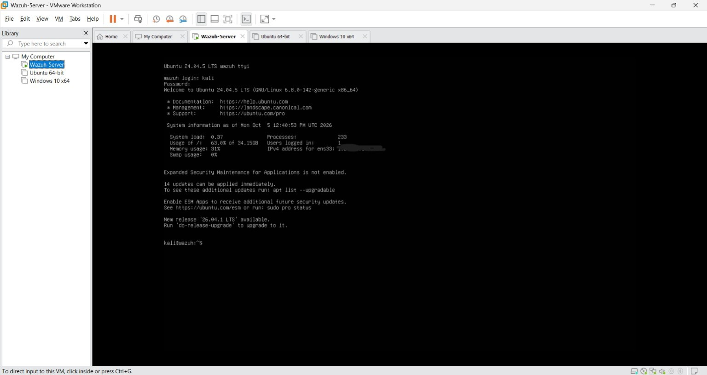

</p>

  
<p align="center">
<b>Figure 1 --- Wazuh Server VM running in VMware WorkstationPro </b>
</p>

**What this proves:** The lab infrastructure was built using a dedicated
virtual machine for the Wazuh server.

------------------------------------------------------------------------

# 5. Wazuh Dashboard

After deploying the Wazuh environment, the Wazuh web interface was
accessed from the lab network.

The overview provides centralized visibility into endpoint status,
alerts and security monitoring capabilities.

The dashboard provided visibility into areas such as:

-   Active agents
-   Alert severity
-   Endpoint Security
-   File Integrity Monitoring
-   MITRE ATT&CK
-   Threat Hunting
-   Vulnerability Detection

### Evidence --- Wazuh Overview


<p align="center">

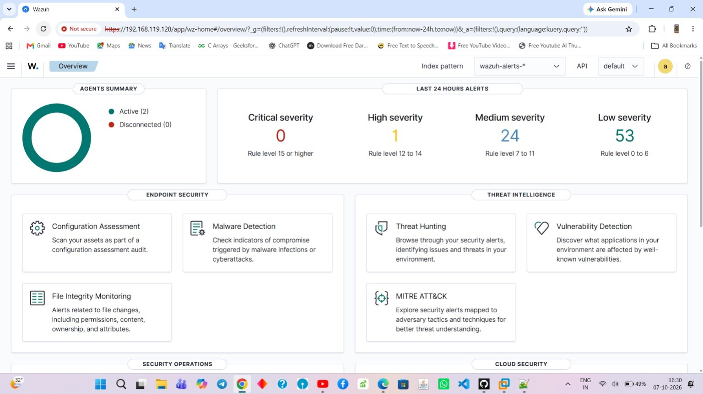
</p>


<p align="center">

<b>Figure 2 --- Wazuh Overview dashboard</b>
</p>

**What this proves:** The Wazuh SIEM interface was successfully deployed
and accessible for centralized security monitoring.

------------------------------------------------------------------------

# 6. Endpoint Deployment

Two endpoints were enrolled with the Wazuh Manager.

  Agent ID   Agent Name      Operating System     Status
  ---------- --------------- -------------------- --------
  001        `Dev_windows`   Windows 10 Pro       Active
  002        `ari_linux`     Ubuntu 24.04.5 LTS   Active

### Evidence --- Active Wazuh Agents


<p align="center">

 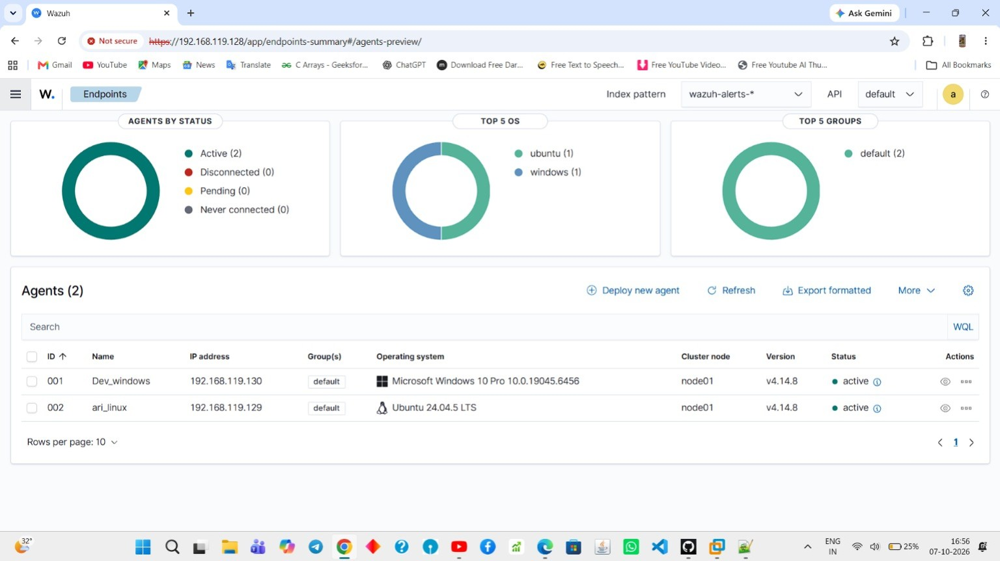 
</p>

  
<p align="center">

 <b> Figure 3 --- Windows and Linux endpoints visible in
Wazuh</b>
   
</p>

**What this proves:** Both monitored endpoints were enrolled and
communicating with the Wazuh Manager.

------------------------------------------------------------------------

# 7. Sysmon Telemetry

Sysmon was used to increase endpoint visibility beyond standard
operating-system logs.

## 7.1 Windows Sysmon

Sysmon was installed on the Windows endpoint and verified through the
Windows Services console.

The screenshot shows:

-   Service name: `Sysmon`
-   Display name: `Sysmon`
-   Startup type: `Automatic`
-   Service status: `Running`

### Evidence --- Windows Sysmon Service


<p align="center">

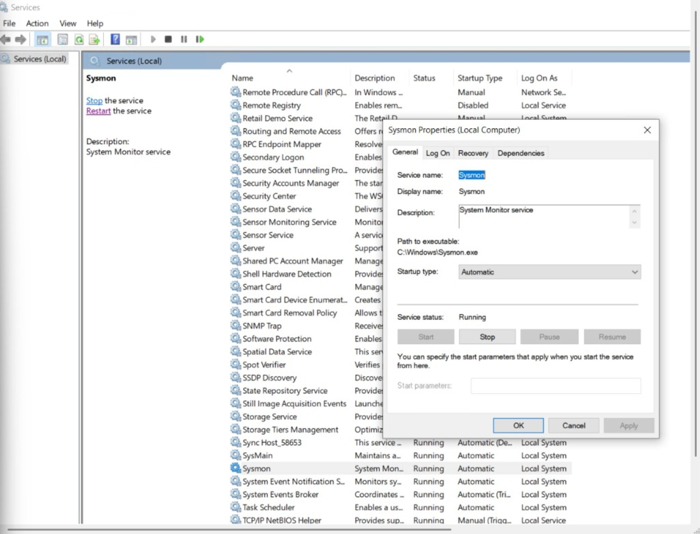
</p>


<p align="center">

<b>Figure 4 --- Sysmon service running on the Windows
endpoint</b>
</p>

**What this proves:** Sysmon was installed, configured to start
automatically and running on the Windows endpoint.

------------------------------------------------------------------------

## 7.2 Linux Sysmon

Sysmon for Linux was configured on the Ubuntu endpoint. The
configuration was loaded and validated using the Sysmon command-line
interface.

The collected telemetry contains system-event information such as:

-   Process IDs
-   Executable paths
-   Users
-   Event IDs
-   Timestamps
-   Network-related information

### Evidence --- Linux Sysmon Configuration and Validation


<p align="center">

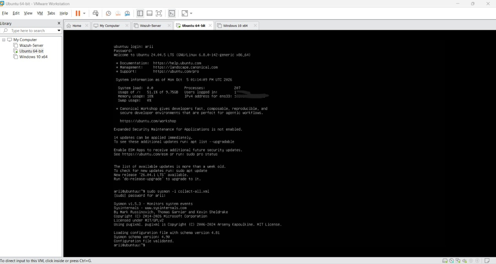
</p>


<p align="center">

<b>Figure 5 --- Linux Sysmon configuration validation and
generated telemetry</b>
</p>

**What this proves:** Sysmon for Linux was configured successfully and
was producing system telemetry.

### Evidence --- Linux Telemetry


<p align="center">

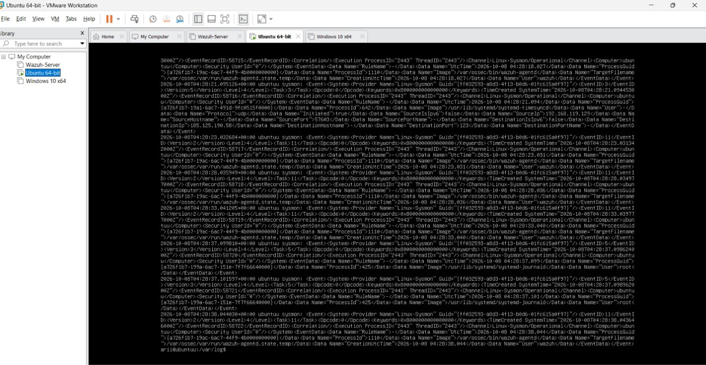
</p>


<p align="center">

<b>Figure 6 --- Linux endpoint telemetry collected from
Sysmon</b>
</p>

**What this proves:** The Linux endpoint was generating detailed
telemetry that could be monitored as part of the SOC workflow.

------------------------------------------------------------------------

# 8. File Integrity Monitoring (FIM)

Wazuh File Integrity Monitoring uses the **Syscheck** component to
detect changes to monitored files and directories.

FIM can identify activities such as:

-   File creation
-   File modification
-   File deletion
-   Permission changes
-   Ownership changes
-   Other file attribute changes

## 8.1 Linux FIM Configuration

The Linux Wazuh configuration was edited in:

 text
/var/ossec/etc/ossec.conf


The configuration enabled Syscheck and included monitored directories
such as:

 text
/etc
/usr/bin
/usr/sbin
/bin
/sbin
/boot


### Evidence --- Linux FIM Configuration


<p align="center">

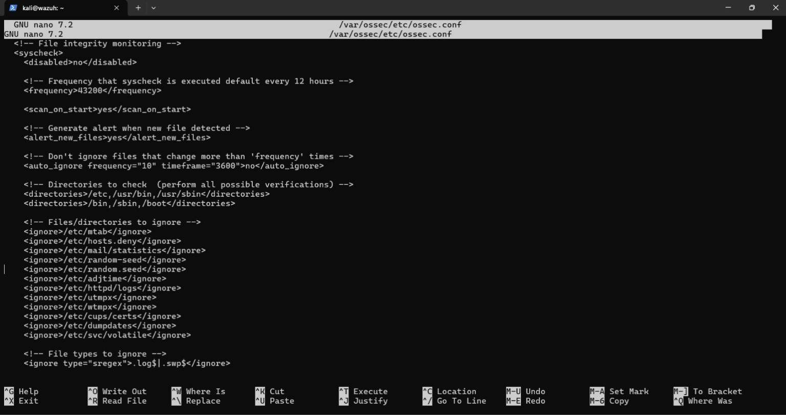

</p>

<p align="center">

<b>Figure 7 --- Linux Syscheck/FIM configuration</b>
</p>

**What this proves:** File Integrity Monitoring was enabled and
configured to monitor important Linux directories.

------------------------------------------------------------------------

## 8.2 Windows FIM Configuration

Windows monitoring was configured for selected Windows system locations
and executables. Realtime monitoring was also configured for selected
directories, including the Startup folder and:

 text
C:\CompanyData


### Evidence --- Windows FIM Configuration


<p align="center">

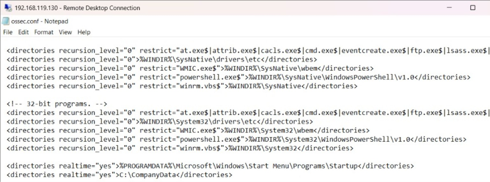
</p>


<p align="center">

<b>Figure 8 --- Windows Syscheck/FIM configuration</b>
</p>

**What this proves:** Windows directories and selected system locations
were configured for integrity monitoring.

------------------------------------------------------------------------

## 8.3 FIM Dashboard

The Wazuh File Integrity Monitoring dashboard was used to verify and
visualize file modification activity.

The dashboard included:

-   Alerts by action over time
-   Top agents
-   Event summaries
-   `syscheck`-related alerts

The monitored agents included `Dev_windows` and `ari_linux`.

### Evidence --- Wazuh FIM Dashboard


<p align="center">

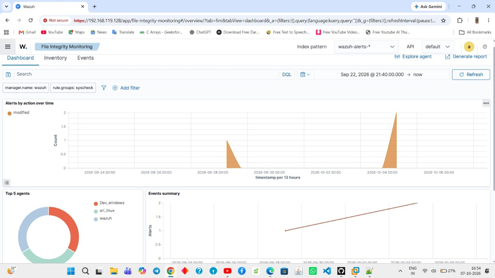
</p>

<p align="center">

<b>Figure 9 --- Wazuh File Integrity Monitoring
dashboard</b>
</p>

**What this proves:** FIM events were reaching Wazuh and could be
visualized and investigated from the dashboard.

------------------------------------------------------------------------

# 9. Custom Wazuh Rules

Custom detection rules were created in Wazuh's `local_rules.xml` file.

The rules demonstrate detection engineering for:

1.  SSH authentication failures
2.  Repeated SSH login failures from the same source IP
3.  Windows Guest account enablement

### Evidence --- Custom Rules in `local_rules.xml`


<p align="center">

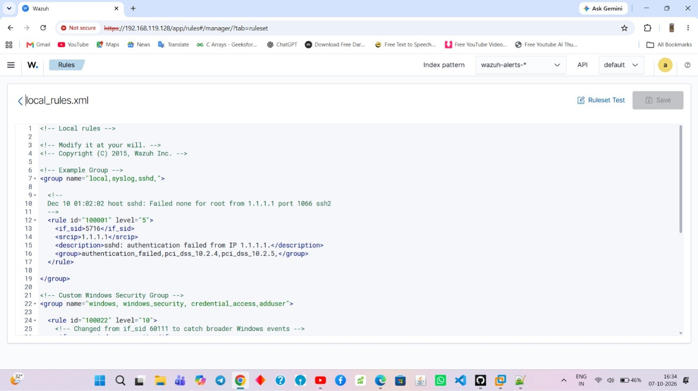
</p>


<p align="center">

<b>Figure 10 --- Custom Wazuh rules configured in
local_rules.xml</b>
</p>

**What this proves:** Custom detection logic was written and added to
the Wazuh rule configuration.

------------------------------------------------------------------------

## 9.1 SSH Authentication Failure Rule

A custom rule was created to detect a specific SSH authentication
failure condition.

 xml
<rule id="100001" level="5">
    <if_sid>5716</if_sid>
    <srcip>1.1.1.1</srcip>
    <description>sshd: authentication failed from IP 1.1.1.1.</description>
    <group>authentication_failed,local,syslog,sshd</group>
</rule>


This demonstrates how a base Wazuh rule can be extended with additional
conditions and a custom description.

------------------------------------------------------------------------

## 9.2 Multiple SSH Login Failure Rule

A correlation rule was created to detect multiple SSH authentication
failures from the same source IP.

 xml
<rule id="100101" level="10" frequency="3" timeframe="120">
    <if_matched_sid>5760</if_matched_sid>
    <same_source_ip />
    <description>Multiple SSH login failures observed from the same source IP</description>
    <mitre>
        <id>T1110</id>
    </mitre>
</rule>


### Detection logic

-   Match the relevant SSH authentication failure event.
-   Track events from the same source IP.
-   Trigger after 3 matching events.
-   Use a 120-second time window.
-   Map the detection to MITRE ATT&CK technique **T1110 --- Brute
    Force**.

The rule was later observed triggering in the Wazuh alert/investigation
view.

------------------------------------------------------------------------

## 9.3 Windows Guest Account Detection

A custom Windows security rule was created to detect when the built-in
Guest account is enabled.

The rule uses Windows Event ID `4722` and checks the target username for
`guest`.

The detection was mapped to MITRE ATT&CK **T1078.002 --- Valid Accounts:
Default Accounts**.

### Evidence --- Windows Custom Detection Rule


<p align="center">

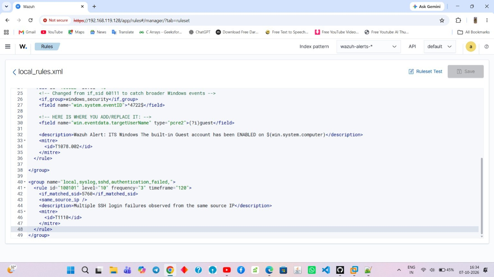
</p>


<p align="center">

<b>Figure 11 --- Windows Guest account detection
rule</b>
</p>

**What this proves:** A Windows security event was mapped to custom
Wazuh detection logic and a MITRE ATT&CK technique.

------------------------------------------------------------------------

# 10. Custom Rules Loaded in Wazuh

The Wazuh Rules interface confirmed that the custom rules were loaded
into the environment.

  Rule ID    Description                                             Level
  ---------- ----------------------------------------------------- -------
  `100001`   SSH authentication failure                                  5
  `100022`   Windows built-in Guest account enabled                     10
  `100101`   Multiple SSH login failures from the same source IP        10

### Evidence --- Rules Overview


<p align="center">

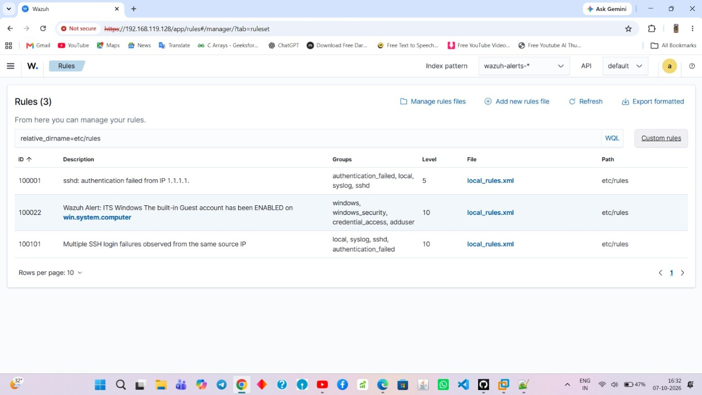
</p>


<p align="center">

<b>Figure 12 --- Custom rules loaded in the Wazuh Rules
interface</b>
</p>

**What this proves:** The custom detection rules were successfully
recognized and loaded by Wazuh.

------------------------------------------------------------------------

# 11. Security Alert Generation

After endpoint activity was generated, Wazuh collected and analyzed the
events.

The alerts were viewed through the `wazuh-alerts-*` index.

The alert interface provided information such as:

-   Timestamp
-   Rule description
-   Agent
-   Source IP
-   Event information
-   Security rule details

### Evidence --- Wazuh Alerts


<p align="center">

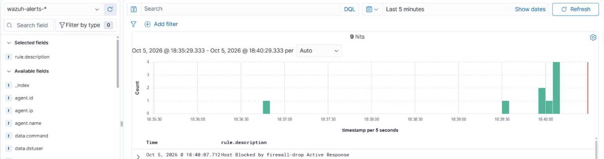
</p>


<p align="center">

<b>Figure 13 --- Security alerts visible in the Wazuh alert
index</b>
</p>

**What this proves:** Endpoint events were successfully processed into
security alerts by Wazuh.

------------------------------------------------------------------------

# 12. Alert Investigation with Wazuh Discover

The Wazuh Discover interface was used to investigate individual security
events.

The investigation view exposed detailed event fields including:

-   Agent ID and name
-   Source IP
-   Rule ID
-   Rule description
-   MITRE ATT&CK information
-   Authentication failure information
-   Active Response information

### Evidence --- Wazuh Discover Investigation


<p align="center">

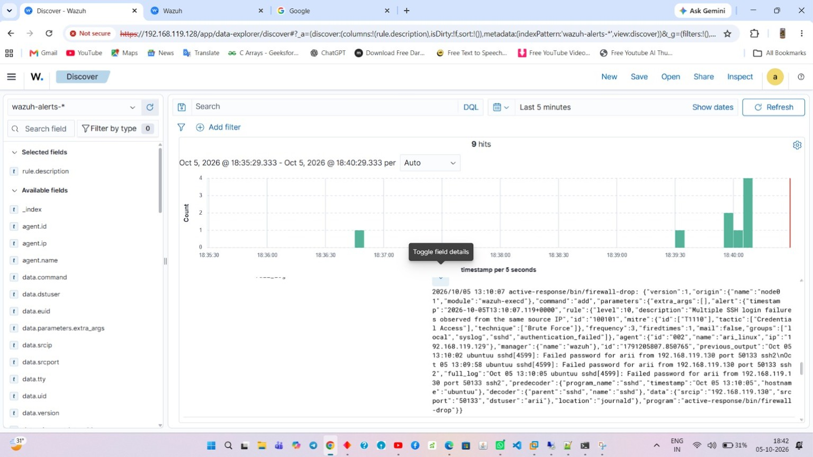
</p>


<p align="center">

<b>Figure 14 --- Detailed alert investigation in Wazuh
Discover</b>
</p>

**What this proves:** A SOC analyst can move from a high-level alert
into detailed event fields for investigation and correlation.

One observed event showed repeated SSH authentication failures and an
Active Response action involving `firewall-drop`.

------------------------------------------------------------------------

# 13. Active Response

The lab also demonstrated Wazuh Active Response.

An observed alert contained an action similar to:

 text
active-response/bin/firewall-drop


The event indicated that a host was blocked using the firewall-drop
Active Response mechanism.

### Evidence --- Detection to Response
<p align="center">


</p>


<p align="center">

<b>Figure 13 --- Security alerts visible in the Wazuh alert
index</b>
</p>

The Active Response information is visible in the Wazuh Discover
investigation shown above in **Figure 14**.

This demonstrates the SOC workflow:

 text
Detection → Alert → Investigation → Automated Response


**What this proves:** The lab was not limited to passive logging; it
also demonstrated automated response to a selected security event.

------------------------------------------------------------------------

# 14. Custom SOC Dashboard

A custom dashboard named **Ari-Basic SOC Activity Overview** was created
to provide a simplified SOC analyst view.

The dashboard included visualizations for:

-   Linux failed SSH logons
-   Windows failed logons
-   Windows account changes
-   Event counts
-   Source IP information
-   Authentication-related activity

### Evidence --- Custom SOC Dashboard


<p align="center">

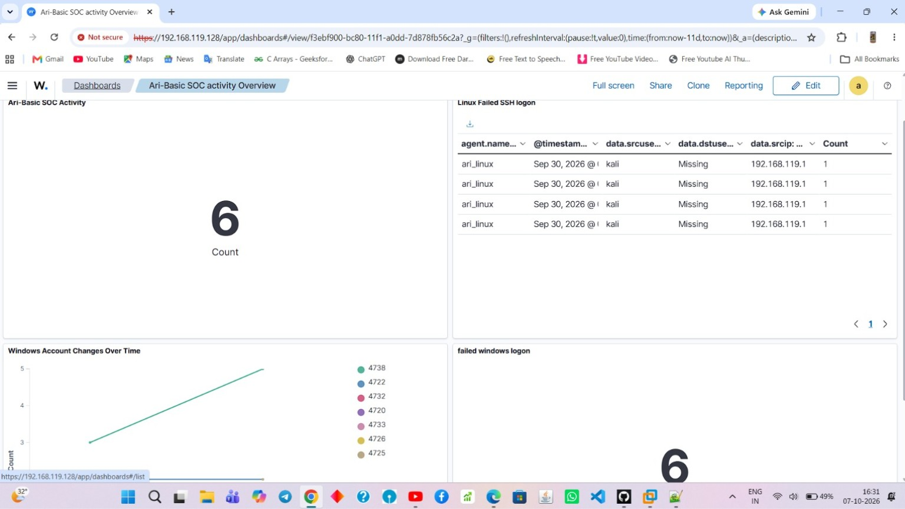
</p>


<p align="center">

<b>Figure 15 --- Ari-Basic SOC Activity Overview
dashboard</b>
</p>

**What this proves:** Security events from the monitored endpoints were
consolidated into a custom SOC-oriented dashboard for quick visibility.

------------------------------------------------------------------------

# 15. End-to-End SOC Workflow

The complete monitoring workflow can be represented as:

``` text
                   Endpoint Activity
                          |
                          v
                  Wazuh Agent / Sysmon
                          |
                          v
                   Telemetry Collection
                          |
                          v
                     Wazuh Manager
                          |
                          v
                   Decoders + Rules
                          |
                          v
                    Security Alert
                          |
             +------------+------------+
             |                         |
             v                         v
      Wazuh Dashboard           Wazuh Discover
             |                         |
             +------------+------------+
                          |
                          v
                   Alert Investigation
                          |
                          v
                    Active Response
```

The screenshots throughout this README provide evidence for each major
stage of this workflow.

------------------------------------------------------------------------

# 16. Evidence / Proof of Implementation

This repository intentionally places the screenshots **inside the README
next to the related implementation step**, so an interviewer can
understand and verify the work without opening a separate screenshot
folder.

### Evidence covered

  Implementation                          Evidence
  --------------------------------------- --------------
  Wazuh server VM                         Figure 1
  Wazuh dashboard                         Figure 2
  Endpoint enrollment                     Figure 3
  Windows Sysmon                          Figure 4
  Linux Sysmon                            Figures 5--6
  Linux FIM                               Figure 7
  Windows FIM                             Figure 8
  FIM activity                            Figure 9
  Custom rules                            Figure 10
  Windows security detection              Figure 11
  Rules loaded                            Figure 12
  Security alerts                         Figure 13
  Alert investigation / Active Response   Figure 14
  SOC dashboard                           Figure 15

------------------------------------------------------------------------

# 17. Repository Structure

``` text
wazuh-soc-home-lab/
│
├── README.md
│
└── screenshots/
    ├── 01-wazuh-server.jpg
    ├── 02-wazuh-overview.jpg
    ├── 03-endpoints.jpg
    ├── 04-windows-sysmon-service.jpg
    ├── 05-linux-sysmon.jpg
    ├── 06-windows-fim-config.jpg
    ├── 07-linux-fim-config.jpg
    ├── 08-fim-dashboard.jpg
    ├── 09-custom-rules-file.jpg
    ├── 10-custom-rules-windows.jpg
    ├── 11-rules-overview.jpg
    ├── 12-discover-alert.jpg
    ├── 13-soc-dashboard.jpg
    ├── 14-alerts.jpg
    └── 15-linux-telemetry.jpg
```

------------------------------------------------------------------------

# 18. Skills Demonstrated

This project demonstrates practical experience with:

-   SIEM deployment and administration
-   Wazuh Manager and Agent
-   VMware virtualization
-   Windows security monitoring
-   Linux security monitoring
-   Sysmon
-   File Integrity Monitoring
-   Log and telemetry collection
-   Detection engineering
-   Custom Wazuh rules
-   Event correlation
-   SSH authentication monitoring
-   MITRE ATT&CK mapping
-   Alert investigation
-   Active Response
-   SOC dashboard creation
-   Basic incident detection and response

------------------------------------------------------------------------

# 19. Security Notes

This project was created in an isolated home-lab environment.

Before publishing the repository publicly, ensure that you do not
commit:

-   Passwords
-   API keys
-   Private keys
-   Authentication tokens
-   Sensitive configuration files
-   Production IP addresses
-   Personal credentials

The screenshots in this repository are intended as documentation of the
lab environment.

------------------------------------------------------------------------

# 20. Future Improvements

Potential improvements include:

-   Add additional Windows and Linux endpoints.
-   Integrate network monitoring using tools such as Zeek or Suricata.
-   Add threat-intelligence feeds.
-   Create more MITRE ATT&CK detection scenarios.
-   Add additional correlation rules and automated response playbooks.
-   Expand the SOC dashboard with severity, timeline and incident
    metrics.

------------------------------------------------------------------------

## Conclusion

This Wazuh home lab demonstrates an end-to-end SOC monitoring workflow
in a controlled virtual environment:

**Collect → Detect → Alert → Investigate → Respond → Visualize**

The embedded evidence screenshots show the actual configuration,
telemetry, detections, alerts and dashboards produced during the lab.
